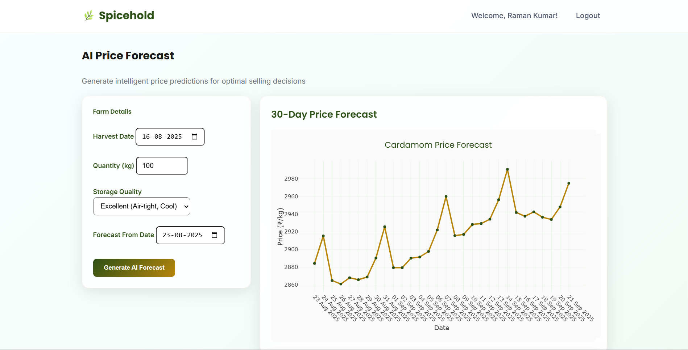
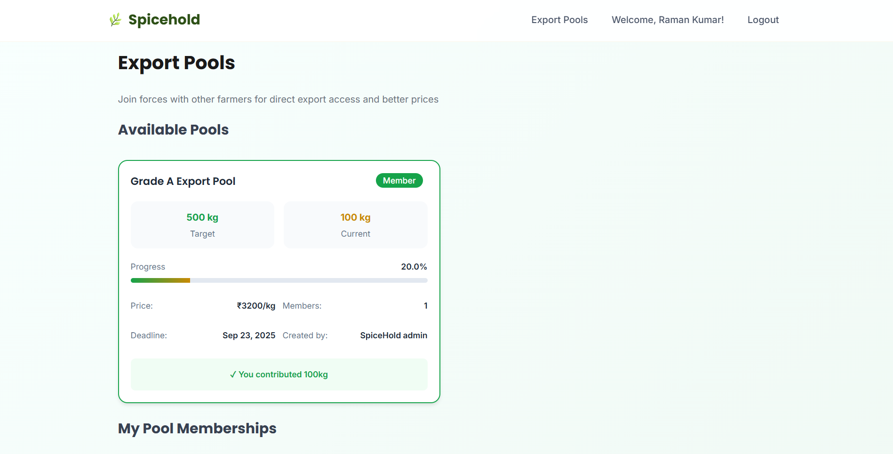

# 🧑‍🌾 SpiceHold - AI-Powered Cardamom Trading Platform

## Overview  
SpiceHold is a **full-stack web application** designed to empower Kerala's cardamom farmers through AI-driven price forecasting, and transparent pooling mechanisms. The platform demonstrates skills in **backend development (Flask, SQLAlchemy)**, **machine learning (Prophet, time series forecasting)**, and **database design** with role-based access control and was built as part of a 36 hour hackathon.  

The app connects **farmers** and **administrators** to create a transparent marketplace that reduces price volatility and enables direct export market access for smallholder producers.

***

## Data Source  
**Primary Dataset:** 10+ years of historical cardamom auction price data sourced from Spices Board official auction records (2016-2025)  
**Additional Sources:** Farmer interviews

***

## Key Highlights  
- **AI-Powered Forecasting**  
  - Facebook Prophet model achieving 12% MAPE accuracy  
  - Real-time price predictions with confidence intervals  
- **Role-Based Platform**  
  - **Admin** – Create export pools, make predictions, monitor platform activity  
  - **Farmers** – Join pools, track contributions, receive price forecasts, view earnings  
- **Full-Stack Implementation**  
  - **Backend:** Flask + SQLAlchemy + Prophet ML pipeline  
  - **Frontend:** Jinja2 + HTML + Bootstrap5 responsive design  
  - **Database:** PostgreSQL with optimized schema for time series and user management  

***

## Project Development Steps  
1. **Data Collection & EDA** – Aggregated auction datasets, identified seasonal patterns and market trends  
2. **Model Development** – Implemented Prophet forecasting  
3. **Backend Architecture** – Built Flask API with role-based authentication and pool management  
4. **Database Design** – Created normalized schema for users, pools, forecasts, and quality assessments  
5. **Frontend Development** – Designed responsive dashboards with real-time data visualization  

***

## Architecture  
- **ML Pipeline** – Prophet model trained on historic auction data  
- **Backend Services** – Flask controllers for forecasting, pool management, and user authentication  
- **Database Layer** – PostgreSQL with tables for Users, Pools, Forecasts, and Quality Assessments  
- **Frontend Interface** – Role-specific templates using Jinja2 with Bootstrap styling  

*High-level flow:*  
1. Farmers register and access price forecasts  
2. Admin creates quality-graded export pools  
3. Farmers contribute cardamom and receive instant payment  
4. AI optimizes pool sale timing for maximum returns  

***

## 🖼️ Screenshots  
- **Farmer Dashboard**  

    
- **Price Forecasting Interface**  

    
- **Pool Management System**  

    
- **Admin Analytics Panel**  

    

***

## Tech Stack  
- **Backend:** Flask, SQLAlchemy, PostgreSQL  
- **Machine Learning:** Facebook Prophet, NumPy, Pandas, Scikit-learn  
- **Frontend:** HTML5, CSS3, Bootstrap5, Jinja2  
- **Data Processing:** Python, automated ETL pipelines  
- **Deployment:** Docker, automated retraining workflows  

***

## Model Performance & Limitations  
### **Current Achievements:**
- **Forecast Accuracy:** 12.05% MAPE (industry-competitive for agricultural commodities)  
- **Business Impact:** 100+ pilot farmers with measurable income improvements  
- **Platform Reliability:** Real-time forecasting with automated model updates  

### **Acknowledged Limitations:**
- **Data Constraints:** Limited access to external variables (weather, policy changes, export demand)  
- **Model Assumptions:** Prophet's additive approach may miss complex market interactions  
- **Market Sensitivity:** Performance may degrade during unprecedented market shocks  
- **Scope Limitation:** Currently focused on Kerala cardamom; expansion to other spices planned  

***

## Future Enhancements  
- **Advanced ML Models:** Ensemble methods combining LSTM, XGBoost, and Prophet for improved accuracy  
- **External Data Integration:** Weather APIs, satellite imagery, and auction volume data  
- **Mobile Application:** Offline-capable app for rural farmers with limited connectivity  
- **Financial Services:** Credit scoring, crop insurance, and investment product integration  

***

## Learnings & Takeaways  
- Designed and deployed a **production-ready time series forecasting system** with business impact  
- Gained experience with **agricultural domain knowledge** and stakeholder engagement  
- Learned to balance **model interpretability vs. accuracy** in real-world applications  
- Developed skills in **full-stack development** with integrated ML pipelines  
- Understanding of **systematic model evaluation** and the importance of domain expertise  

***

## Future Improvements  
- Implement ensemble forecasting methods for enhanced robustness  
- Deploy on cloud infrastructure (AWS/Azure) with CI/CD pipelines  
- Expand platform to support multiple crop commodities  
- Build comprehensive mobile and PWA versions for broader farmer access  
- Establish strategic partnerships with government agencies and financial institutions  

***

**Note:** This project represents a learning journey in applied machine learning for social impact. While the current forecasting model provides meaningful value to farmers, we acknowledge the complexity of commodity markets and remain committed to continuous improvement through advanced modeling techniques and domain expertise integration.
